# Braai Gifting Co

Braai Gifting Co is an online fictional retailer that specializes in selling barbecue gift packages. The company seeks a website design that embodies its brand essence, "Give the gift of braai and create lasting memories," in an appealing way to its target audience. The website features a static responsive design and was created using HTML and CSS. Its aim is to provide a stress-free shopping experience for its customers.

The website consists of the following pages:

1. Landing Page
2. Photo Gallery
3. Order Form

Meta keywords for Braai Gifting Co could include: barbecue gifts, gift packages, stress-free shopping, outdoor cooking, gift guide, order form, photo gallery, user experience, responsive design, HTML, CSS.

A live version of the project can be accessed here: [Braai Gifting Co Website](https://blignaut24.github.io/Braai-Gift-Co-Website/)

# User Experience (UX)

## Project Goals

---

### Site Owners Goals:

- The main goal is to increase sales by creating a sales funnel on the website.
- Promote the Braai Boxes clearly, consistently, and attractively to new and returning customers through the website.
- Create a stress-free shopping experience for customers.

### User Goals:

- The busy user wants a hassle-free gift-giving experience and curated options to alleviate the anxiety of selecting the perfect gift.
- The website must effectively answer the following three questions about the Braai Gift Company in less than 5 seconds:
    - What does the company offer?
    - How will it make my life better?
    - What do I need to do to buy it?

### User Expectations

- An easy and intuitive navigation system
- Easy access to any information
- Working links
- Every page accessible regardless of screen size
- A simple contact form

## User Stories

---

### As a first time user:

As a first time user, I want to have a stress-free and hassle-free experience when shopping for barbecue gift packages. I expect the website to provide me with curated options that will alleviate my anxiety of selecting the perfect gift. I want the website to answer the following three questions about Braai Gifting Co in less than 5 seconds: 

1. What does the company offer?
2. How will it make my life better?
3. What do I need to do to buy it?

### As a returning user:

As a returning customer, I want to quickly find the information I need about Braai Gifting Co's products and services. I expect to see any new updates or changes to the website since my last visit. Additionally, I would like to be able to easily navigate to the order form to place a new order without having to search for it.

### As a site owner:

As a business owner, I want to increase sales for Braai Gifting Co by creating a sales funnel on our website. I want our website to effectively promote our Braai Boxes to new and returning customers through clear, consistent, and attractive messaging. Additionally, I want to create a stress-free shopping experience for our customers to ensure they keep coming back for more.

## Strategy

---

Considering the core UX principles, I first started to think about the strategy for this website and defined who the target users would be and what features/technologies they would want.

Braai Gifting Co's target users are:

- Target audience: people looking for a simple and special way to give a gift to those who are interested in or enjoy outdoor cooking, usually men between the ages of 21 and 65 who enjoy eating meat.
- The website helps reduce stress when giving gifts by offering a carefully chosen selection of unique gift options and an easy shopping experience.
- The website acts as a gift guide and offers advice on barbecuing and gift-giving.

What users expect from the website:

- An easy and intuitive navigation system.
- Easy access to any information.
- Beautiful photos that show the rewards of giving a well-received gift.
- Links that work as expected.
- Every page accessible regardless of screen size.
- An order form.

The website design focuses on simplicity for two reasons:

1. To avoid overwhelming the user with too much information, as cognitive overload can increase confusion and result in a loss of sales.
2. Due to users' busy lifestyles, it is assumed that most users will be viewing the site on their mobile phones. Therefore, creating something responsive is integral to the design.

## Scope

---

Please note that this project focuses solely on front-end development. Therefore, the order form will be submitted through a third-party provider that provides a thank-you message at the end of the order process. No data will be stored or processed, as this is solely a front-end focused project.

The website will include the following features:

- Navigation bar to navigate to various website pages
- Landing page that acts as the main sales funnel for the user
- Gallery of images showing Braai Box content and Braai food
- Order form to place a Braai Box order
- Links to affiliate social media pages
- Footer with all the contact details, business registration, and social media links of the company.

## Structure

---

This is a multi-page website consisting of three main pages: a landing page, an order form, and a photo gallery. The navigation bar is fixed and scrolls with the user, creating an easy and intuitive navigation system. Additionally, this structure simplifies access to the desired information.

The landing page follows a Storybrand format with text blocks interspersed with images. Each section of the page contains two direct and indirect call-to-action buttons.

The gallery page provides a variety of pictures showcasing the product and the lifestyle associated with the business. The aim is to stimulate the user's imagination regarding the great food and memorable experiences that a Braai Box can provide.

When designing the contact order form, the following guidelines from UXPin were kept in mind:

- Reduce form fields to only necessary information.
- Use specific form field types.
- Break up long forms into manageable steps.
- Use explicit names and labels for buttons and fields.

## Skeleton

### Wireframe

### Style guide

Please note that the actual website may have changed slightly from these wireframes created by Balsamiq and Figma.

## Surface

---

### Color Palette

In selecting the color palette for the website, the aim was to strike a balance between the high-end feel of a luxury brand and the welcoming warmth of communal cooking in an outdoor setting. The idea was to create a visual representation of the brand that would resonate with its target audience and convey the essence of the product in a compelling way.

To achieve this, each color used in the palette was carefully chosen to reflect the different elements of a braai. The white color symbolizes purity and cleanliness, while black represents power and sophistication. The red color conveys passion and excitement, and the grey color represents neutrality and balance.

By combining these colors in the website design, we aimed to create a cohesive look and feel that would appeal to the target audience and promote the brand's identity. Overall, the website's color palette was chosen to create a visual representation that is both beautiful and meaningful, and that captures the essence of the brand in an impactful way.

### Typography

In order to effectively evaluate the company "Brand Story," it was crucial to select three fonts that were not only practical and stylish, but also complemented the overall brand image. After careful consideration, I opted to use Montserrat for the headings, Lora for subheadings, and Mind Madurai for paragraphs. These fonts not only convey a sense of professionalism and modernity, but also lend themselves well to the company's aesthetic. Additionally, selecting the right font for the company logo name was equally important. After experimenting with several options, I ultimately decided on Aboretto, which perfectly captured the essence of the brand's identity and values.

## Features

---

The website is fully responsive, ensuring that it can be accessed from a variety of devices. It has been divided into three pages: a landing page, gallery, and order form, each with its own unique style and purpose. The navbar is sticky and always accessible to the user, making it easy to navigate through the website.

In order to improve accessibility for users with slight visual impairments, a careful selection of color scheme and fonts has been made. The simplistic style not only enhances the overall aesthetic of the website but also helps to achieve a higher level of website performance.

The company's sales funnel is the main theme running through the website, with the user being exposed to two direct calls to action and two indirect calls to action by the red buttons. The holistic design and layout aim to reduce the user's cognitive workload when processing information, thus creating a more enjoyable user experience.

Images used on the website have been sourced from free license websites, with a diverse range of people being used to create an inviting community. Furthermore, the website acknowledges the fact that every culture in the world cooks on fire and celebrates this fact. To this end, the website provides information on different types of fire cooking and how they are used around the world, thus promoting cultural diversity and inclusivity.

### Navbar

The hamburger icon has become a popular choice for mobile-first websites due to its simplicity and space-saving benefits. However, it may not be the best choice for every website, particularly when considering the business goals of the owner. In this particular case, we have decided to use a sticky navigation bar instead of the hamburger icon in order to promote the sales funnel and to ensure that users can easily navigate the website. The sticky navigation bar will provide a more prominent and consistent placement of the navigation menu, making it easier for users to find what they need. Additionally, we have incorporated a hover effect on the order button, which changes color when users hover over it. This subtle but effective design element can help increase user engagement and improve the overall user experience of the website.

 

### Order Form

The order form is a crucial part of any business, and the fact that it loads quickly provides an excellent user experience. The clear guidance offered by the form ensures that any user, regardless of their level of technical expertise, can complete it with ease, reducing the risk of abandonment. By preventing the user from feeling overwhelmed, the form is designed to increase business productivity. It is also worth noting that a well-designed order form can be a key driver of repeat business, as it encourages customers to return to the site and purchase again.  Compare the slick modern form with the older version I had planned. 

        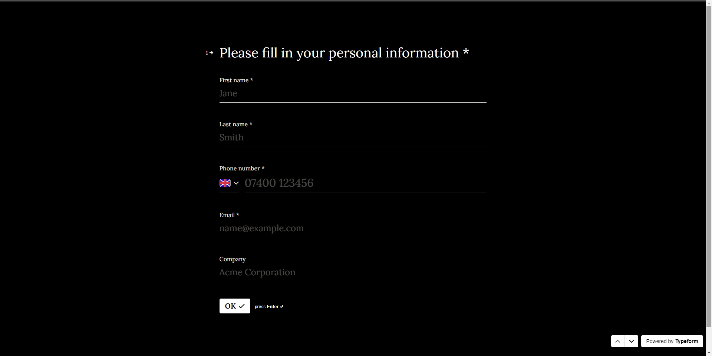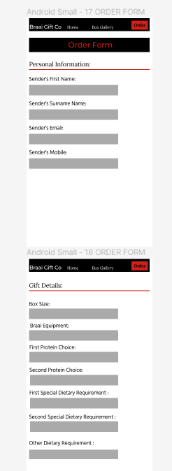

# Technologies Used

---

I have used several technologies that have enabled this design to work:

- HTML, CSS, Google Fonts, Font Awesome, Google Developer Tools, Mozilla Firefox Tools, Responsively App, Notion, Figma, Balsamiq, Notion AI, GitHub, Git, Gitpod, VS Code, Code Anywhere, Tiny.png, W3C Markup Validation Service, W3C CSS Validation Service, Freeformatter CSS Beautify, Prettier, Freeformatter HTML Formatter, AmIResponsive, Typeform, and WebAIM were all used in this project.

# Testing

---

## User Stories

**For first-time visitors to the website, it is important that potential customers are able to quickly and easily understand what product is being sold, how it can benefit them, and how they can purchase it.** 

    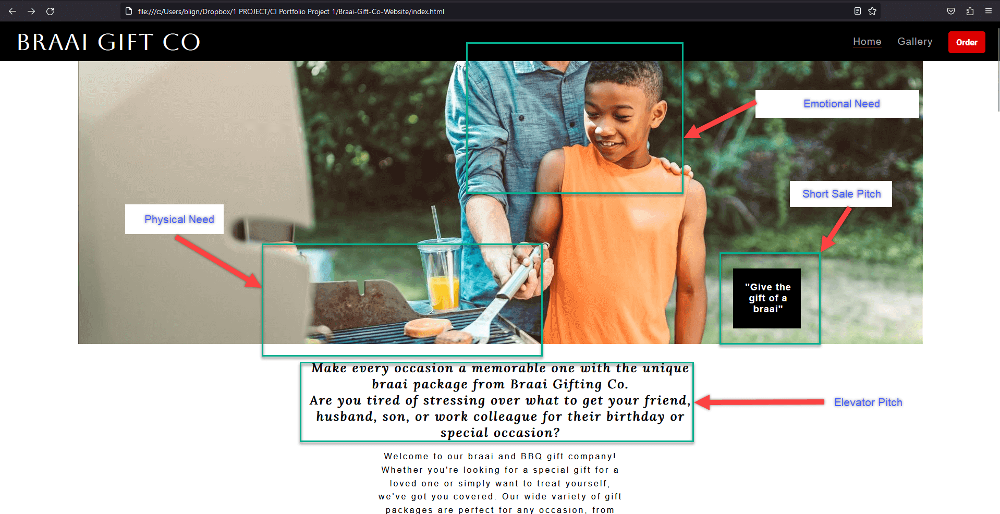
   
    
    
**Each section on the landing page tells a brief story about the product to the client.**

Our approach to storytelling is intentional and purposeful. We believe that by presenting information in a narrative format, customers are more likely to engage with it, pay attention to it, and remember it. Storytelling has been used for centuries as a way to convey important messages and ideas, and we believe that it is just as relevant today, especially in the digital age where we are constantly being bombarded with information.

When you visit our website, you will notice that each section is designed with a specific purpose in mind. The landing page, for example, is where we introduce you to our brand and showcase our products. The photo gallery provides a visual representation of what we offer, while the order form is where you can place an order and complete your purchase. Each section serves a specific purpose, but when combined, they tell a cohesive story that embodies our brand essence: "Give the gift of braai and create lasting memories."

We believe that our approach to storytelling sets us apart from other retailers. By presenting information in a way that is engaging and memorable, we hope to create a stress-free shopping experience that you will enjoy and remember. So next time you visit our website, keep an eye out for the mini-stories that make up our grand story, and let us know what you think. 

        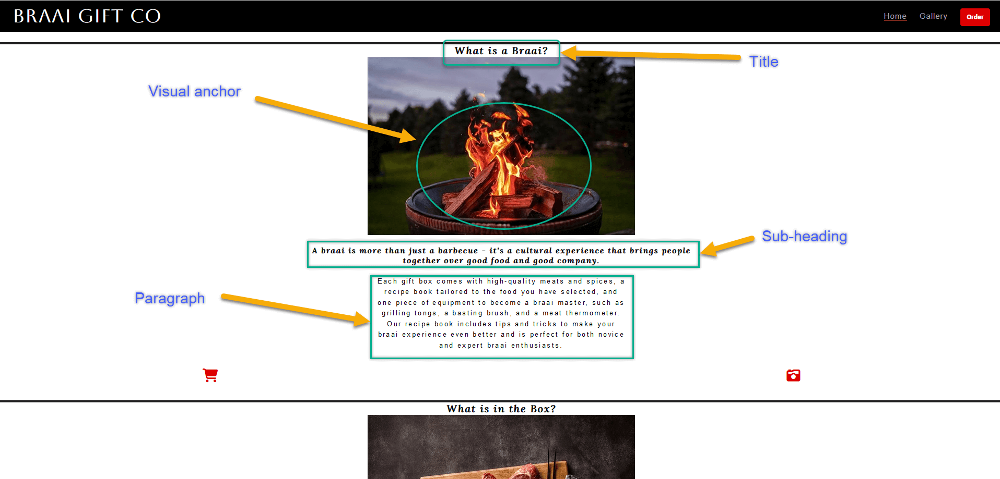

**The user can quickly understand the purpose of the business and navigate the site with ease.**
    
    Our website's minimalist design, which intentionally leaves whitespace at the side of the text, was created with the reader's experience in mind. We wanted to ensure that our customers could easily get into a reading flow and avoid distractions from the browser.
    
    As we know, a customer's time and attention are short, and we believe that our page layout is best suited for our business needs. By prioritizing the customer's reading experience, we hope to create a stress-free shopping journey that is enjoyable and memorable.
    
    Our minimalist design not only facilitates the reader's flow but also creates a modern and elegant look that is both professional and user-friendly. Additionally, it ensures that our content is easily accessible and digestible, making it more likely for our customers to engage with our brand and ultimately make a purchase.
    
    Overall, the design philosophy is centered around creating a website that is intuitive, visually appealing, and easy to navigate. I believe that our minimalist layout achieves these goals and enhances the overall user experience, helping us to stand out from the competition and build long-lasting relationships with our customers.
    
    
**The gallery aims not only to ignite customers' imagination but also to provide them with a comprehensive understanding of the business's product.** 

        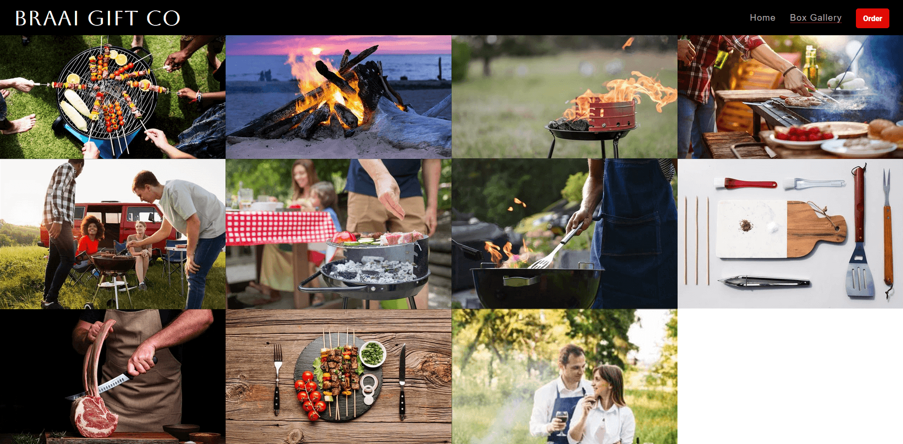   
       
    

**5. The order process is streamlined to keep the customer engaged with the sales funnel and encourage repeat business. Filling out a long questionnaire, such as the one below, can drive away sales.** 

        

## **Lighthouse**

Lighthouse is a feature of Google Chrome developer tools and is used to assess the performance of the website and its features. I scored very well in  all of the categories.

        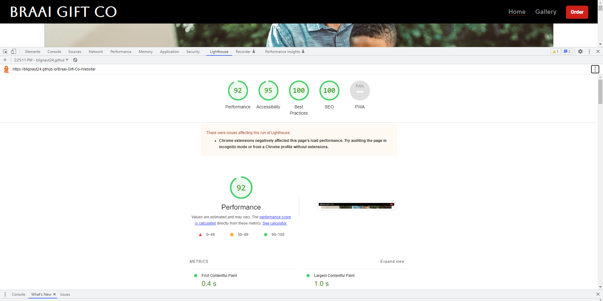

In addition to passing these validations, the website has also performed well in other areas. For example, it was evaluated using Lighthouse, a feature of Google Chrome developer tools that assesses the performance of websites and their features. The website scored very well in most areas, including accessibility, best practices, and SEO, earning a high score of 97 out of 100. This is a testament to the website's design and implementation, which prioritize user experience and accessibility.

## **HTML and CSS Validation**

The website, which is designed to be simple and clear, passed both HTML and CSS validations with flying colors, requiring only a few minor alterations. The HTML validator, which checks the syntax and structure of the website's code, confirmed that the website's markup was correct and free of errors. Meanwhile, the CSS validator, which evaluates the website's cascading style sheets, found that the website's styles were well-organized and properly implemented. These validations are important because they ensure that the website is accessible to all users, regardless of their device or browser, and that it conforms to industry standards for web development. By passing these validations, the website demonstrates its commitment to quality and user experience.

        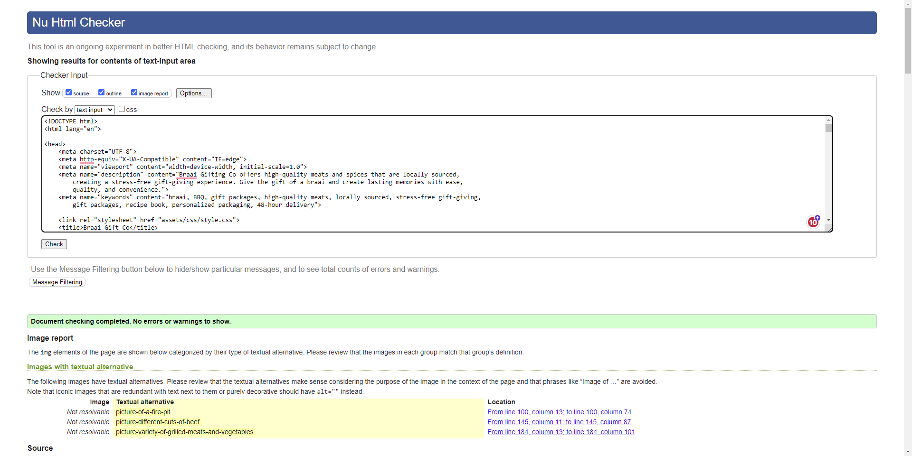

Overall, the website has proven to be a high-quality and effective tool for Braai Gifting Co to reach and engage with its target audience. By passing validations and performing well in various assessments, the website has demonstrated its commitment to excellence and user satisfaction.

        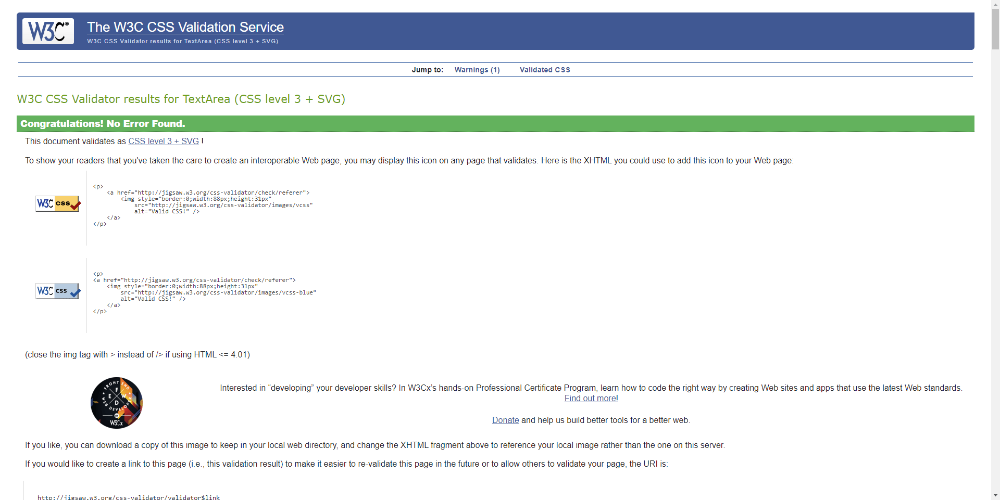

### ****Known bugs and fixes****

The majority of my issues come from responsive design problems, as I coded with a mobile-first approach due to lack of experience. This approach leads to recurring minor bugs, where fixing one screen size negatively affects another.. 

        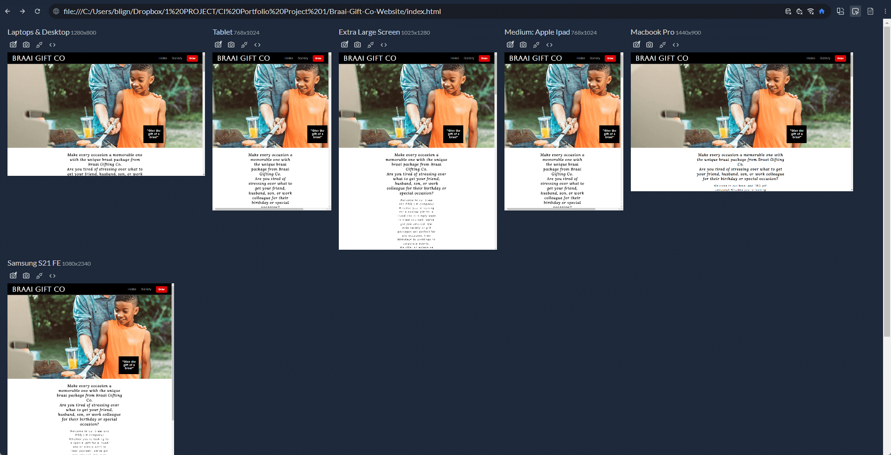

I mainly resolve most issues with Google Chrome Dev Tools and Rubber Ducking it. For example the code below broke my order button link when I was finished with my CSS validation. 

        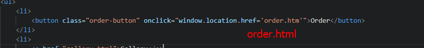

Another bug I cannot seem to solve is resizing my hero image for responsive design. All approaches lead to the images being cut of at the sized depending on the screen size. I did try and find other photo but very few are open sourced and convey my websites messages so well. 

# **Deployment**

## Deployment

I deployed this website by using GitPages and following the below steps:

*GitHub pages deployment*

1. Log in to GitHub
2. In your Repository section, select the project repository that you want to deploy
3. In the menu located at the top of this section, click 'Settings'
4. Select 'Pages' on the left-hand menu - this is around halfway down
5. In the source section, select branch 'Master' and save
6. The page is then given a site URL which you will see above the source section, it will look like the following:

        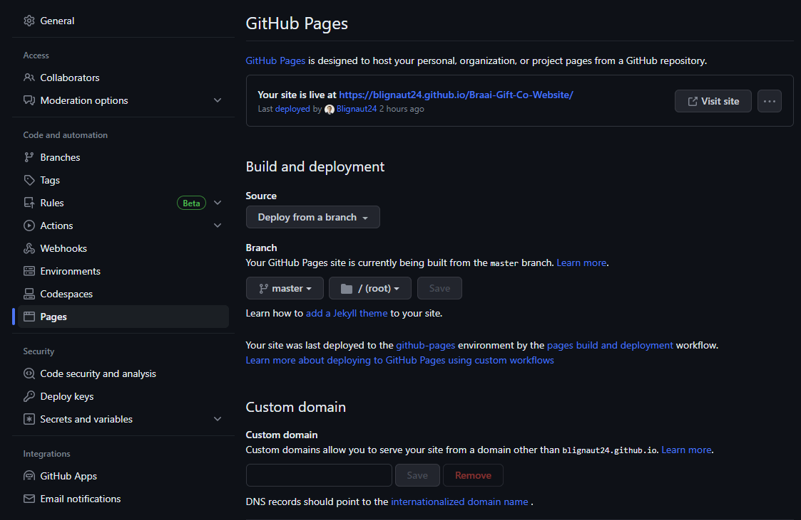

Please note it can take a while for this link to become fully active.

*Forking the GitHub Repository*

If you want to make changes to your repository without affecting it, you can make a copy of it by 'Forking' it. This ensures your original repository remains unchanged.

1. Find the relevant GitHub repository
2. In the top right corner of the page, click the Fork button (under your account)
3. Your repository has now been 'Forked' and you have a copy to work on

*Cloning the GitHub Repository*

Cloning your repository will allow you to download a local version of the repository to be worked on. Cloning can also be a great way to backup your work.

1. Find the relevant GitHub repository
2. Press the arrow on the Code button
3. Copy the link that is shown in the drop-down
4. Now open CodeAnywhere & select the directory location where you would like the clone created
5. In the terminal type 'git clone' & then paste the link you copied in GitHub
6. Press enter and your local clone will be created.

# **Credits**

I have used a number of resources to produce this website, where code has been used found from another source this is credited as a comment within the HTML and CSS.

The following websites/articles were used for research and guidance:

- W3School
- ZTM
- Mmdn web docs_

I used code from the following resources:

- [Typeform](https://www.typeform.com/try/typeformbrand/?gclsrc=aw.ds&&tf_campaign=europe-brand-english-combined_18008307788&tf_source=google&tf_medium=paid&tf_content=150888936711_654632140542&tf_term=typeform&tf_dv=c&tf_matchtype=e&tf_adposition=&tf_location=1010543&gclid=Cj0KCQjwgLOiBhC7ARIsAIeetVBk7hNXy8mYqtwZhHJ2X-EEZ34PFtnfyp8_IKhQQdMy9BXA6C8lL_0aAm5OEALw_wcB&gclsrc=aw.ds)
- [Colormind](http://colormind.io/bootstrap/)
- [CSS Scan](https://getcssscan.com/css-buttons-examples)

# **Acknowledgements**

I would like to express my sincere gratitude to God for the blessings in my life, including my beloved wife and family, without whom this journey would not have been possible. I would also like to extend my heartfelt appreciation to the entire Code Institute community, whose unwavering support and encouragement have been instrumental in my success. From the instructors who have imparted their knowledge and guidance, to the fellow students who have shared their insights and experiences, I am deeply grateful for the enriching and collaborative learning environment that Code Institute has provided. Thank you all for your contributions and for believing in me.